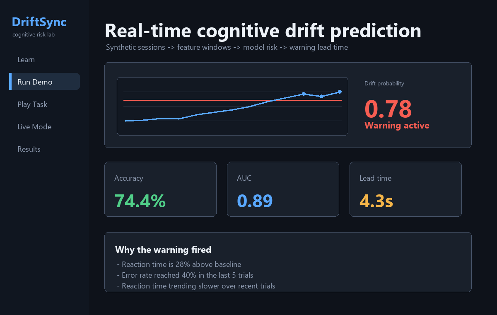
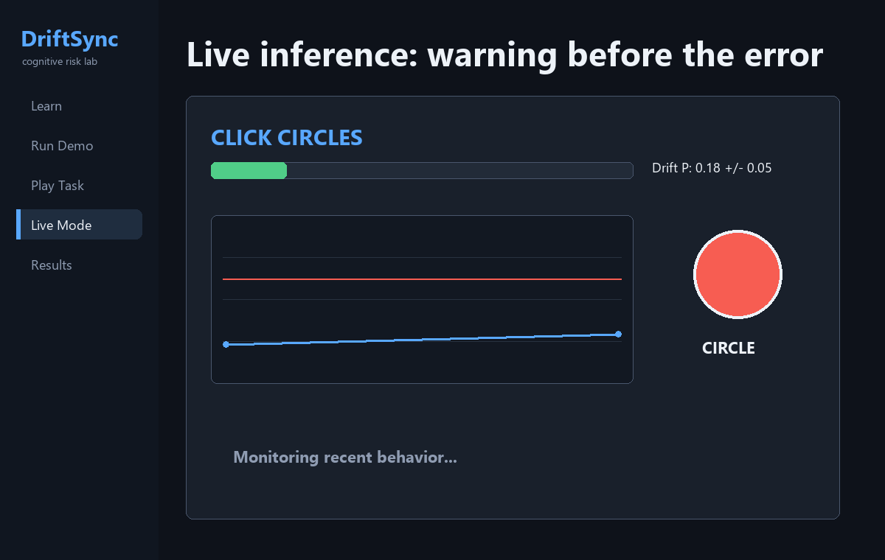
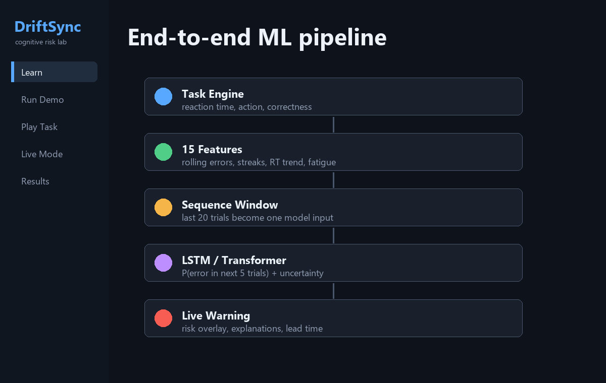
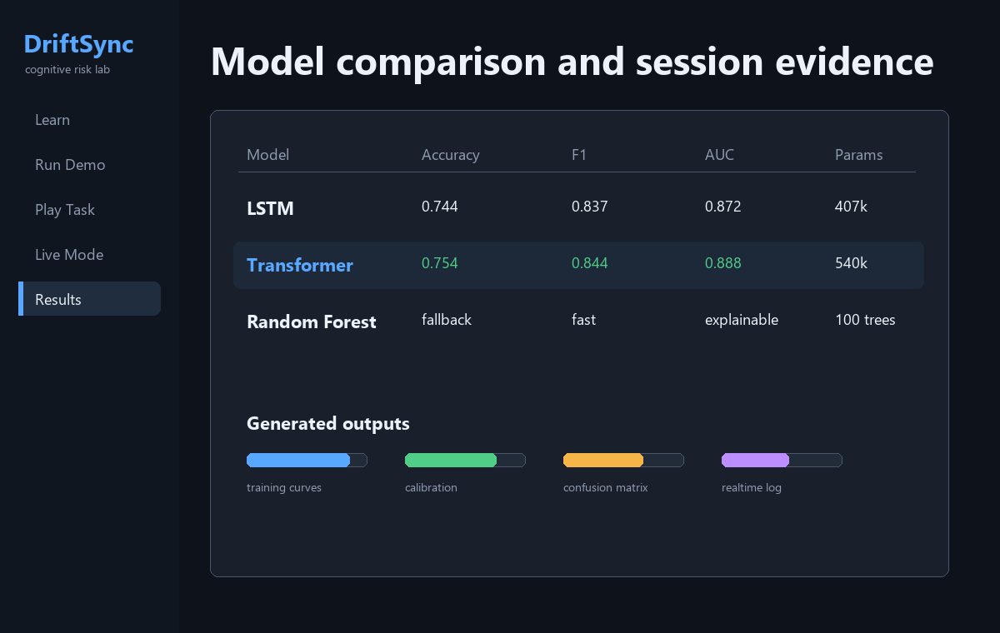

# DriftSync

**Real-time cognitive drift prediction for human error risk.**

[](https://github.com/Bouwles/DriftSync/actions/workflows/tests.yml)


DriftSync is an end-to-end machine learning system that predicts when a person is likely to make a mistake before the mistake happens. It watches behavioral signals from a sustained-attention task, turns them into temporal feature windows, and estimates the probability of an error in the next few trials.

This is a research and portfolio project, not a medical device. It is not clinically validated and makes no health claims.



## Live Demo

The live inference view updates a rolling risk score after each trial. When probability or uncertainty crosses the threshold, the interface raises a warning and explains which behavioral signals are drifting.



## Why It Matters

Human error in repetitive, high-attention work usually does not appear out of nowhere. Reaction time slows. Mistakes cluster. Recovery after an error gets worse. DriftSync models those signals as a sequence prediction problem:

```text
Given the last L trials of behavior,
predict whether an error will occur in the next K trials.
```

Default values:

| Parameter | Meaning | Default |
| --- | --- | --- |
| `L` | Sequence window length | 20 trials |
| `K` | Prediction horizon | 5 trials |
| Features | Behavioral inputs per trial | 15 |
| Warning threshold | Risk level that triggers warning | 0.65 |

## What Makes This Showcase-Worthy

- Full interactive Pygame application, not just a notebook.
- Synthetic data generator, preprocessing, training, evaluation, realtime inference, and results UI.
- LSTM and Transformer sequence models with Monte Carlo Dropout uncertainty.
- Logistic Regression, Random Forest, and threshold fallback paths for graceful demos.
- Per-user calibration baseline for personalized explanations.
- Lead-time tracking: warnings are judged by whether they arrive before errors.
- Automated tests and CI for core behavior.
- README media generated from the project workflow.

## System Flow



```text
Task Engine
  -> raw trial data: reaction time, action, correctness, timestamps
  -> 15-feature engineering layer
  -> sequence windows of the last 20 trials
  -> LSTM / Transformer / baseline predictor
  -> P(error in next 5 trials) + uncertainty
  -> live warning overlay + explanation panel
  -> session metrics and lead-time report
```

## Model Evidence



Representative checked-in synthetic experiment summary:

| Model | Accuracy | Precision | Recall | F1 | ROC AUC | Params |
| --- | ---: | ---: | ---: | ---: | ---: | ---: |
| LSTM | 0.744 | 0.994 | 0.722 | 0.837 | 0.872 | 407,169 |
| Transformer | 0.754 | 0.994 | 0.733 | 0.844 | 0.888 | 540,289 |

These values come from synthetic drift data and should be read as engineering evidence, not real-world validation.

## Feature Engineering

Each trial becomes a normalized 15-dimensional vector:

| Feature | Description |
| --- | --- |
| `reaction_time_norm` | Reaction time normalized by robust session statistics |
| `correctness` | `1` for correct, `0` for error |
| `elapsed_time_norm` | Session progress |
| `rolling_error_rate_5` | Error rate over the last 5 trials |
| `rolling_error_rate_10` | Error rate over the last 10 trials |
| `inter_trial_interval_norm` | Gap between trials |
| `cumulative_errors_norm` | Cumulative error rate |
| `streak_correct` | Current correct streak, normalized |
| `streak_incorrect` | Current error streak, normalized |
| `target_match` | Whether the shown shape matched the rule |
| `action_click` | Whether the user clicked instead of skipping/timing out |
| `rolling_rt_variance` | Short-term reaction-time instability |
| `time_since_last_error_norm` | Recovery distance from the previous error |
| `rt_trend` | Recent slope of reaction time |
| `fatigue_index` | Time-on-task multiplied by cumulative errors |

## Quick Start

```bash
git clone https://github.com/Bouwles/DriftSync.git
cd DriftSync
python -m pip install -r requirements-dev.txt
python -m pytest
python -m driftsync.smoke
python launch.py
```

Useful commands:

```bash
make test        # run pytest
make smoke       # check core package contracts
make quick-demo  # run a short synthetic training/evaluation pass
make launch      # open the Pygame application
```

## Run A Reproducible Experiment

```bash
python run_experiment.py --quick --sessions 5 --trials 80 --epochs 5
```

For a fuller run:

```bash
python run_experiment.py --sessions 20 --trials 200 --epochs 60
```

Outputs are written to `driftsync/results/`. Generated checkpoints, logs, and datasets are ignored by git because they are reproducible and can be large.

## Project Structure

```text
DriftSync/
|-- launch.py                         # Main app launcher
|-- run_experiment.py                 # Headless training/evaluation runner
|-- scripts/generate_showcase_assets.py
|-- docs/
|   |-- assets/                       # README screenshots and GIF
|   `-- realtime-log-schema.md
|-- tests/                            # Pytest coverage for core behavior
`-- driftsync/
    |-- app/application.py            # Pygame application shell
    |-- configs/config.py             # Dataclass configuration
    |-- data/                         # Loading, features, sequence datasets
    |-- evaluation/                   # Metrics and plots
    |-- ml/                           # Calibration, baselines, explanations
    |-- models/                       # LSTM and Transformer predictors
    |-- realtime/                     # Streaming inference
    |-- simulator/                    # Task engine and GUI
    |-- training/                     # Training loop and pipeline
    `-- utils/                        # Logging, metrics, seeding
```

## Realtime Log Schema

Live predictions are saved as JSON events when a trained model is available. See [docs/realtime-log-schema.md](docs/realtime-log-schema.md).

## Project Docs

- [Changelog](CHANGELOG.md)
- [Contributing](CONTRIBUTING.md)
- [Generated artifact policy](docs/generated-artifacts.md)
- [Demo readiness checklist](docs/demo-checklist.md)
- [Realtime log schema](docs/realtime-log-schema.md)

## Verification

Current local verification commands:

```bash
python -m pytest
python -m driftsync.smoke
python scripts/generate_showcase_assets.py
```

## Limitations

- Default training data is synthetic.
- The current task is a shape-click/skip simulator, not a broad cognitive benchmark.
- Real-world deployment would require human-subject data, validation, threshold tuning, and ethics review.
- Lead time depends on threshold choice and the definition of a warning window.

## Roadmap

- Collect real human sessions across different task types.
- Add temporal train/test splits by session date.
- Add an API mode for embedding DriftSync in other applications.
- Add online adaptation from a user's own history.
- Compare longer prediction horizons such as `K=10` and `K=15`.

---

Built to show the full loop: simulation, sequence modeling, realtime prediction, uncertainty, explainability, and evidence.
